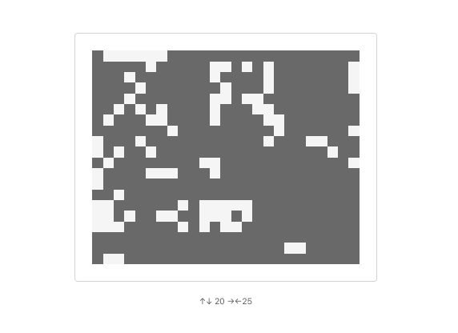

# Conway's Game of Life

A very minimal **Game of Life**, created with React. I created this project while following the **The Joy of React** course, from Josh Comeau: https://www.joyofreact.com/

## Controls

Resize the grid with Up, Down, Left and Right Arrows. Initial state is random, every cell has a 30% chance of being alive. When growing, new cells can be alive or dead. When shrinking, removed cells just disappear 👻

## Screenshot

